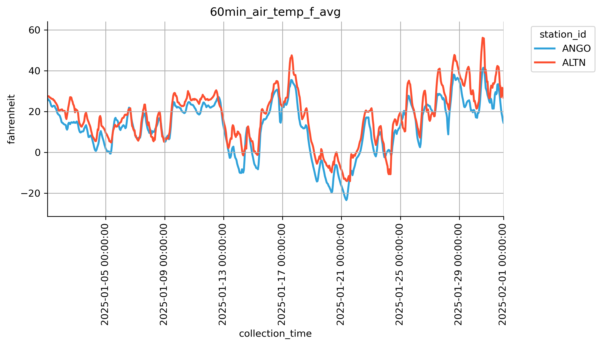

# Wiscopy
Python wrapper for [Wisconet](https://wisconet.wisc.edu/). Currently supporting [API v1](https://wisconet.wisc.edu/docs).

## Main Features
1. Easy to use interface: simply specify the stations, datetime range, and fields you want
2. Data automatically formatted into a pandas DataFrame
3. Fetch large amounts of data with transparent concurrency
4. Automatically respect Wisconet rate limiting (20 requests / 20 seconds)

## Install

### From PyPI

#### base install

To install `wiscopy` from [PyPI](https://pypi.org/project/wiscopy/) run

```bash
python -m pip install wiscopy
```

#### install with plotting library dependencies

```bash
python -m pip install 'wiscopy[plot]'
```

### From conda-forge

To install and add `wiscopy` to a project from [conda-forge](https://github.com/conda-forge/wiscopy-feedstock) with [Pixi](https://pixi.sh/), from the project directory run

```bash
pixi add wiscopy
```

and to install into a particular conda environment with [`conda`](https://docs.conda.io/projects/conda/), in the activated environment run

```bash
conda install --channel conda-forge wiscopy
```

## Usage

### Fetch data from multiple stations, create a Dataframe, and plot.
```python
import hvplot.pandas  # needed for df.hvplot()
import holoviews as hv
from datetime import datetime

from wiscopy.interface import Wisconet

hv.extension('bokeh')
hv.plotting.bokeh.element.ElementPlot.active_tools = ["box_zoom"]

w = Wisconet()
df = w.get_data(
    station_ids=["maple", "arlington"],
    start_time="2025-01-01",
    end_time="2025-02-01",
    fields=["60min_air_temp_f_avg"]
)
df.hvplot(
    y="value",
    by="station_id",
    title="60min_air_temp_f_avg",
    ylabel=df.final_units.iloc[0],
    grid=True,
    rot=90,
)

```


### More examples
see more examples in [notebooks/examples.ipynb](https://github.com/UW-Madison-DSI/wiscopy/blob/main/notebooks/examples.ipynb), or run

```bash
pixi run start
```

## Wisconet

### Current stations
Wisconet's [list of current stations](https://wisconet.wisc.edu/stations.html) shows all active station names. You can get also that list of strings in wiscopy with:
```python
from wiscopy.interface import Wisconet

w = Wisconet()
station_names = w.all_station_names()
```

Wisconet also provides a [map](https://wisconet.wisc.edu/maps.html) of those stations with a dropdown menu including some of the currently available fields/variables. You can determine the fields available per station in wiscopy with:

```python
from wiscopy.interface import Wisconet

w = Wisconet()
station_names = w.all_station_names()
this_station = w.get_station(station_names[0])
fields = this_station.get_field_names()
```


## dev install instructions 
### 1. install pixi
See [pixi install guide](https://pixi.sh/latest/advanced/installation/).

### 2. check out from repo
```bash
git clone git@github.com:UW-Madison-DSI/wiscopy.git
```

### 3. install local editable version
```bash
cd wiscopy
pixi install
```

### 4. run tests
```bash
pixi run test
```

### 5. auto fix ruff linting issues
```bash
pixi run -e dev ruff check --fix .  
```

### 6. run all pre-push checks (format, lint, tests)
```bash
pixi run pre-push  
```

### 7. build package
```bash
pixi run build
```

### 8. run package build, install, and test in clean environment:
```bash
pixi run -e clean-room test-wheel
```


## Contribute
Pull requests welcome! All pull requests must be formated, linted and pass tests