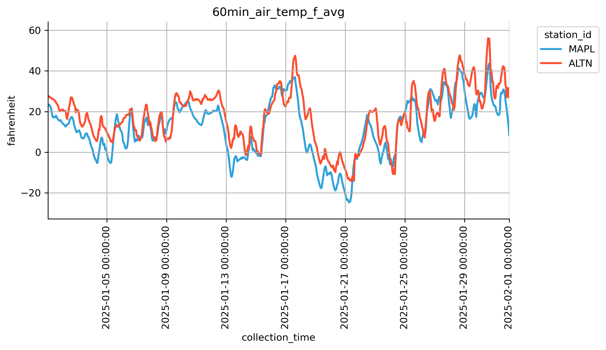

# pywisconet
Python wrapper for the [Wisconet](https://wisconet.wisc.edu/) [API v1](https://wisconet.wisc.edu/docs)

## install
```
git clone pywisconet
cd pywisconet
poetry install
```

## usage
```python
# define date range to collect bulk measures data
start_date = datetime(2024,7,1, tzinfo=ZoneInfo("UTC"))
end_date = datetime(2024,7,2, tzinfo=ZoneInfo("UTC"))

# collect station details from wisconet API
stations = all_stations()
this_station = stations[2]
this_station_fields = station_fields(this_station.station_id)

# select desired measure standard names from available fields
filtered_field_standard_names = filter_fields(
    this_station_fields, 
    criteria=[
        MeasureType.AIRTEMP, 
        MeasureType.DEW_POINT,
        CollectionFrequency.MIN60,
        Units.FAHRENHEIT
    ]
)

# collect bulk measures data from Wisconet API
bulk_measure_response = bulk_measures(
    station_id=this_station.station_id, 
    start_time=start_date, 
    end_time=end_date,
    fields=filtered_field_standard_names
)

# process Wisconet data format to pandas Dataframe and plot
hv.extension('matplotlib')
df = bulk_measures_to_df(bulk_measure_response)
mpl_fig = hv.render(
    df
    .hvplot
    .line(
        x="collection_time", 
        y="value",
        by="standard_name",
        ylabel=Units.FAHRENHEIT.value,
        rot=90,
        width=800, 
        height=400,
        legend="top_left",
        title=f"{this_station.station_name}/{this_station.station_id}\n"
              f"{start_date.isoformat()} to {end_date.isoformat()}"
    )
)
mpl_fig.savefig("specific_data_specific_time.png")
```


### see more examples in the notebooks/examples.ipynb